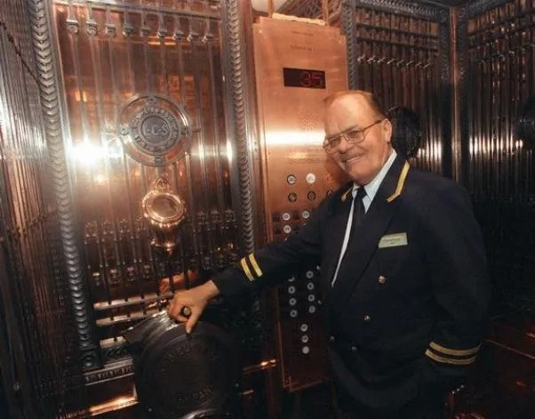
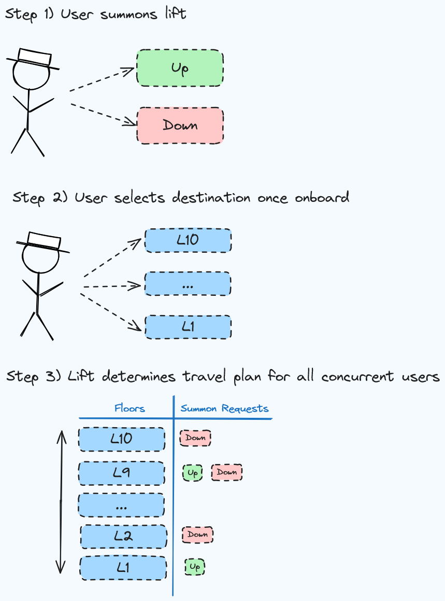

# Going Up?
Software to manage a single virtual elevator in a building with 10 floors (L1 - L10).

## Intro

The purpose of this project is to write a program to control the travel of a lift for a 10 storey building.  
A passenger can summon the lift to go up or down from any floor, once in the lift they can choose the floor they would like to travel to.  
The program needs to plan the optimal set of instructions for the lift to travel, stop, and open its doors.  

### Test Cases

* Passenger summons lift on the ground floor. Once in chooses to go to level 5.
* Passenger summons lift on level 6 to go down. Passenger on level 4 summons the lift to go down. They both choose L1.
* Passenger 1 summons lift to go up from L2. Passenger 2 summons lift to go down from L4. Passenger 1 chooses to go to L6. Passenger 2 chooses to go to Ground Floor.
* Passenger 1 summons lift to go up from Ground. They choose L5. Passenger 2 summons lift to go down from L4. Passenger 3 summons lift to go down from L10. Passengers 2 and 3 choose to travel to Ground.

### Assumptions

* L1 is also the ground level (_there is not a separate G button_).
* L1 only has an "up" elevator button.
* L10 only has a "down" elevator button.
* The elevator does not malfunction in any way (_including exceeding maximum weight capacity_).
* The software is not required to handle race conditions, single threaded execution is expected.

### User Persona

